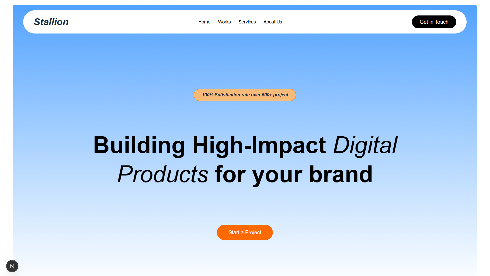

# Day 5 — Immediate Component Analysis

Overview
-
This folder contains Day 5 design iterations with the Immediate component analysis and redevelopments for the project. Below are the updated components, analysis documentation, screenshots, and quick instructions to preview the work locally.

## Immediate Component Analysis

**Overall Layout Structure:**
- **Container** — Max height 1000px
  - Logo
  - Navigation — 200px width
  - Button (CTA)
  - Hero Section
    - Container (flex, flex-col)
    - H2 — size 2xl
    - H3 — size sm
    - CTA button
  - Image — max-height 500px, rounded lg

> **Note:** Use semantic HTML tags throughout all components

Updated components
-
- `Immediate` — analyzed layout and component structure
- `paletRoss` — visual analysis and refinements
- `stallion` — revised layout and assets
- Redeveloped component — combined improvements and fixes

Screenshots
-
Immediate component:


Pallet Ross analysis:


Stallion analysis:


Redeveloped component:


## Day 6 — Scaler Component Analysis

**Overall Layout Structure:**
- **Container** — full-screen dark gradient and structured hero section
- **Header** — site title, nav links, and contact CTA
- **Hero Block** — centered headline, subtext, and action button
- **Glow & Wave Section** — layered glow effects and a custom terrain wave illustration

Updated components
-
- `Scaler` — analysed layout and redeveloped version
- `Immediate` — analysed layout and component structure
- `paletRoss` — visual analysis and refinements
- `stallion` — revised layout and assets

Screenshots
-
Analysed Scalar:


Redeveloped Scalar:

## Day 8 — Spade Component Redevelopment

**Overall Layout Structure:**
- **Container** — full-height landing section with centered content and a soft neutral background
- **Header** — brand title, navigation, and contact CTA
- **Hero Card** — finance platform messaging with AI/transaction focus and clear call to action
- **Visual details** — translucent overlay, rounded panel, and responsive spacing

Updated components
-
- `Spade` — redeveloped finance platform hero section
- `Scaler` — analysed layout and redeveloped version
- `Immediate` — analysed layout and component structure
- `paletRoss` — visual analysis and refinements
- `stallion` — revised layout and assets

Screenshots
-
Analysed Spade:


Recreated Spade:


How to preview
-
If this workspace is a Next.js project, run the dev server and open the app in your browser:

```bash
pnpm install
pnpm dev
```

Notes
-
- Images are located in the `public` directory used by the app.
- Component sources live under `src/Component` (see `Immediate.tsx`, `paletRoss.tsx`, and `stallion.tsx`).

If you'd like, I can also open `src/Component/paletRoss.tsx` and apply formatting or improve the README further.